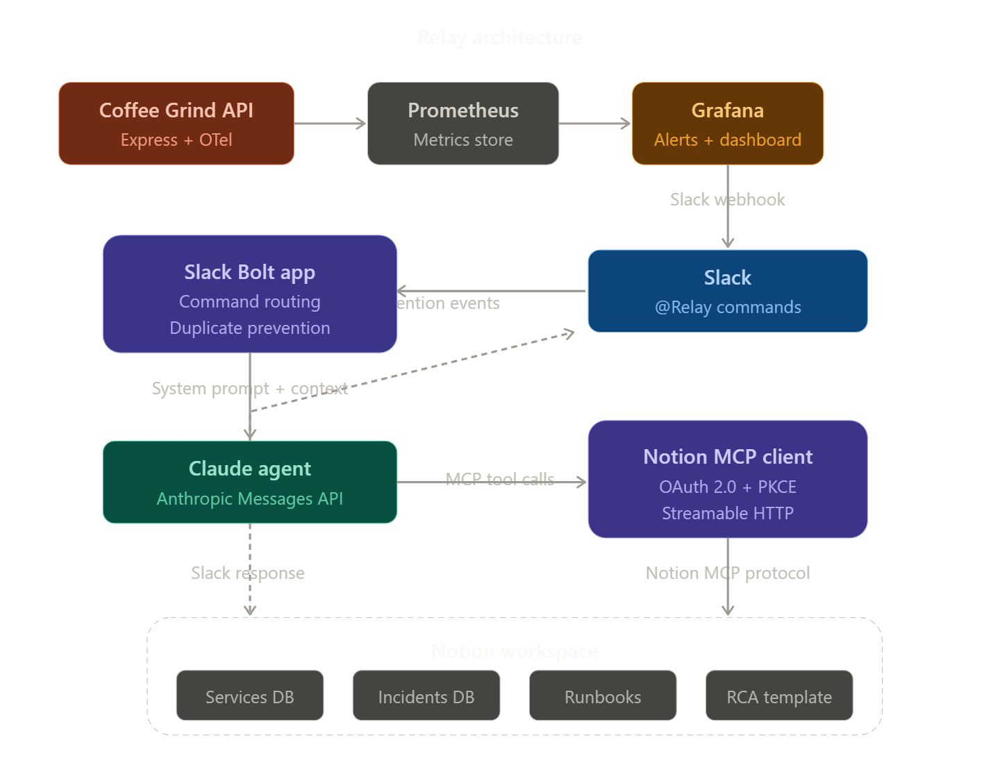

Relay - An Incident Management Assistant That Lets You Focus On Fixing The Problem

*This is a submission for the [Notion MCP Challenge](https://dev.to/challenges/notion-2026-03-04)*

## What I Built

Relay is an incident management assistant that connects Slack with Notion via the Model Context Protocol. It was born from a real pain point — when you're on an incident call focused on mitigation, there's no time to pause and take structured notes or maintain a timeline. Most of that documentation happens after the fact in a post-mortem process that's time-consuming, tedious, and often inaccurate since you're reconstructing events from memory and scattered messages.

Relay solves this by letting engineers manage incidents directly from a Slack thread. A Claude agent with access to the Notion MCP handles the documentation in real-time — creating structured incident pages, maintaining timelines, cross-referencing runbooks and past incidents, and drafting postmortems on close. The result is a living document that grows alongside the incident, giving responders a shared view of what's happening, what's been tried, and what to do next.

**Architecture:** Slack Bot + Claude Agent + Notion MCP Client

I used `@` mentions over `/` slash commands since custom slash commands aren't supported in Slack threads. Keeping everything in-thread was a key design choice — the thread timestamp serves as a unique incident identifier, and all context stays in one place. I also integrated with the standard Notion API to check for existing threads, preventing duplicate incident pages from being created for the same alert.

For simplicity, I created a [Notion template](https://pewter-clutch-c09.notion.site/Relay-An-Incident-Management-Assistant-331e03a0298080edbaeddc113e183bad?pvs=74) that contains all the databases and page templates needed for an MVP.

## Video Demo

[Video Demo](https://www.youtube.com/watch?v=6ckxTgrkaZE)

## Show us the code

[Github Repo](https://github.com/Caposto/notion-mcp-incident-management-assistant)

## How I Used Notion MCP

At first I was mapping specific Notion tool calls to specific Slack commands, but I quickly realized I was just calling the standard Notion API with extra steps. The real power of MCP is letting the agent decide how to interact with the workspace.

My Slack bot acts as a thin orchestration layer — it parses the command context, selects the appropriate system prompt, and hands everything to a Claude agent along with the MCP tool definitions. The agent then autonomously searches the workspace for services, runbooks, and past incidents, and composes structured pages using the templates it finds. This means the agent can adapt its behavior based on what's actually in the workspace rather than following a rigid script.

I built a custom MCP client based on the [Notion MCP docs](https://developers.notion.com/guides/mcp/build-mcp-client), using OAuth 2.0 with PKCE for authentication. On startup, the client prints an authorization link to the console — clicking it completes the OAuth flow and connects the app to the Notion workspace.

## What's Next

- **Async command processing** — Decouple Slack events from agent execution by placing commands in a queue, allowing a background worker to process them without blocking the Slack event loop
- **Multi-MCP integration** — Add Grafana and Jira MCP servers behind an MCP gateway to pull in dashboards, logs, and task tracking alongside Notion
- **Agent optimization** — Refine prompts and reduce token usage to bring down cost and latency (currently ~$0.36 and ~6 minutes for a create-incident run)
- **PII filtering** — Add a filtering layer (e.g. Amazon Macie) to scrub sensitive information before it reaches the agent
- **Collaborative reconciliation** — Allow multiple responders to contribute notes during an incident and reconcile them into the final page

<!-- Team Submissions: Please pick one member to publish the submission and credit teammates by listing their DEV usernames directly in the body of the post. -->

<!-- Thanks for participating! -->